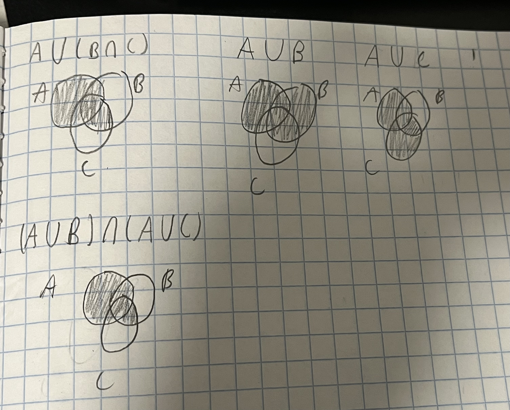

## Question 1

### Using venn diagrams

From the photo, it can be seen that A ∪ (B ∩ C) = $(A \cup B) \cap (A \cup C)$

### Using the distributive law for binary literals
Using the following equivalencies: 
* $\cup$ = +
* $\cap$ = *

A ∪ (B ∩ C) = $A + (B * C)$

Using the distributive law, A + (B*C) = (A + B) * (A + C)

$A + (B * C) = (A + B) * (A + C)$

Using the equivalencies stated above, $(A + B) * (A + C) = (A \cup B) \cap (A \cup C)$

Since we showed that A ∪ (B ∩ C) = $A + (B * C)$, and $A + (B * C) = (A \cup B) \cap (A \cup C)$, 
we can conclude that A ∪ (B ∩ C) = $(A \cup B) \cap (A \cup C)$

### prove that |A ∪ B ∪ C| = |A| + |B| + |C| − |A ∩ B| − |B ∩ C| − |A ∩ C| + |A ∩ B ∩ C|.

$|A \cup B \cup C| = (A - B - C) + (B - A - C) + (C - B - A) + (A \cap C - (A \cap B \cap C)) + (A \cap B - (A \cap B \cap C)) + (C \cap B - (A \cap B \cap C)) + (A \cap B \cap C)$

## Question 2

Set $A$ has r elements and set $B$ has n elements

### What is the number of possible total functions f : A → B?

For a function f to be a total function, each element in $A$ must map to 
and element in $B$. Since each element in $A$ can map to n elements in $B$, and there are
no further constraints on the function being injective or surjective, we have
n possible outputs for each element in $A$. 

We can define a bijection between counting the number of total functions and
counting the number of sequences in the set $(n_1, n_2, n_3, .... n_n)^r$, where 
each element in the ith position represents the value in $B$ that the ith element in 
$A$ maps to.

For any sequence of the form described above, we can map it to a function where
$f(r_1) = n_1, f(r_2) = n_2, ..... f(r_n) = n_n$. Similarly, we can map any
function to a sequence which describes the output of the ith element in $A$.

Since we have a bijection, we know that counting the number of sequences
in the set $(n_1, n_2, n_3, .... n_n)^r$ is equivalent to counting
the number of possible total functions.

The number of possible sequences are $r^n$, meaning there are $r^n$ number of
total functions.

### If r > n, what is the number of injective functions f : A → B?
For a function to be injective, each element in $A$ must map to a unique 
element in b. If $|A| > |B|$, then there exists two elements in $A$ which map
to the same element in $B$ by the pigeonhole principle.

Since two elements in $A$ mapping to the same element in $B$ disqualifies f from 
being a injective function, there exist no injective functions when r > n.

### If r ≤ n, what is the number of injective functions f : A → B?
For a function to be injective, each element in $A$ must map to a unique
element in b. Since $|A| \le |B|$, we can select r elements from $B$ to use 
as the values that each element in $A$ maps to.

We can define a bijection between the number of injective functions and 
the number of ways we can form a string of size r using the values from 1 
to n, where the element in the ith position in the string represents the value
in $B$ that $f(r_i)$ maps to. 

For every string of the form described above, we can map it to a function 
that maps the values of $r_i$ to their corresponding value in $B$. For every 
injective function, we can map it to a string which describes the value 
that $r_i$ maps to.

Since we have a bijection, we know that counting the number of ways we
can form a string of size r using the values from 1 to n is equivalent to 
counting the number of injective functions.

The number of ways we can form a string of size r using the values from 1
to n is $\binom{n}{r} * r!$.

Therefore, the number of injective functions is $\binom{n}{r} * r!$.

### If r = n, what is the number of bijective functions f : A → B?
For a function to be bijective, it must be injective and surjective. This means
that every element in $B$ is mapped to by a unique element in $A$.

We can define a bijection between the number of bijective functions and
the number of ways to permute a string of n elements, where the element in the
ith position is the value that $f(r_i)$ maps to. For any string of the 
form described recently, it can be mapped to a function that maps $r_i$ to 
the values in the sequence. Any function can be mapped to a string which
describes the value that the ith element of $A$ maps to. 

The number of ways to permute a string of n elements is $n!$.

Therefore, the number of bijective functions is $n!$.

### If r < n, what is the number of bijective functions f : A → B?
For a bijective function, $|A| = |B|$. Since this condition is not satisfied,
there exists no possible bijective function considering the condition that r < n.

### We have 5 identical black balls and 1 ball each of 5 colors {red, green, blue, yellow, violet}. In how many different ways can we choose 5 balls?

Since the black balls are identical, I know that the sequences of the form
$(black_1, black_2, red, green, blue)$ is equivalent to 
$(black_4, black_5, red, green, blue)$. Since I would be double counting by
not considering these types of cases, I know that what matters is the number
of black balls. Therefore, I must focus on counting the cardinality of 
the power set of the five non-black colors. With every subset, if there are
less than five balls in the set, I add the black balls to the set. This way, 
I avoid overcounting by only adding black balls to the unique subsets.

The number different ways we can we choose 5 balls is $|\mathcal{P}({red, green, blue, yellow, violet})|$ 

= $2^{|{red, green, blue, yellow, violet}|}$ 

= 32.

There are 32 different ways we can we choose 5 balls. 

## Question four
Let P be the set of all possible plates, L = {A, B, . . . , Z} 
be the set of upper-case letters, and D = {0, 1, . . . , 9} be
the set of digits.

### Express P in terms of L, D using the set union ∪ and product × operations 

Let $L_{3l3d}$ be the set of all licence plates where three letters are followed
by three digits.

$L_{3l3d} = L^3 \times D^3$

Let $L_{5l}$ be the set of all licence plates where there are five letters.

$L_{5l} = L^5$

Let $L_{2c}$ be the set of all licence plates with two characters.

Let $C = L \cup D$.

$L_{2c} = C^2$

$P = L_{3l3d} \cup L_{5l} \cup L_{2c}$ 

$P = (L^3 \times D^3) \cup (L^5) \cup (C^2)$

### Using the sum rule and the product rule, compute |P|

Since $P$ is pairwise disjoint, $|P| = |L_{3l3d}| \cup |L_{5l}| \cup |L_{2c}|$.

$|L_{3l3d}|$ 

= $|L^3 \times D^3|$ 

= $|L|^3 \times |D|^3$ 

= $26^3 \times 10^3$ 

$|L_{5l}| = |L^5|$

= $|L|^5$

= $26^5$

$|C| = |L \cup D| = |L| + |D| - |L \cap D|$

$|C| = 26 + 10 - 0 = 36$

$|L_{2c}| = |C \times C|$

= $|C| \times |C|$

= $36 \times 36$

= $36^2$

$|P| = |L_{3l3d}| \cup |L_{5l}| \cup |L_{2c}|$ 

$|P|`= 26^3 \times 10^3 + 26^5 + 36^2$ 

$|P| = 26^3(10^3 + 26^2) + 36^2$

## Question five

### Prove Pascal's identity algebraically

$\binom{n}{k} = \binom{n!}{k!(n-k)!}$

$\binom{n - 1}{k - 1} = \binom{(n - 1)!}{(k - 1)!(n - k)!}$

$\binom{n - 1}{k} = \binom{(n - 1)!}{(k)!(n - 1 - k)!}$

$\binom{n - 1}{k - 1} + \binom{n - 1}{k} = (n-1)!(\frac{1}{(k-1)!(n-k)!} + \frac{1}{k!(n - 1 - k)!})$

$\binom{n - 1}{k - 1} + \binom{n - 1}{k} = (n-1)!(\frac{k}{(k)!(n-k)!} + \frac{n - k}{k!(n - k)!})$

$\binom{n - 1}{k - 1} + \binom{n - 1}{k} = (n-1)!(\frac{n}{(k)!(n-k)!})$ 

$\binom{n - 1}{k - 1} + \binom{n - 1}{k} = (\frac{n!}{(k)!(n-k)!})$  

= $\binom{n}{k}$

## Question six

### In how many ways can 12 identical mathematics books be distributed among the students Anna, Beth, Candy, and Daniel?

I must distribute 12 bananas among 4 lunchboxes.

I have three dividers and 12 bananas.

The ways of distributing 12 identical mathematics books among Anna, Beth, Candy, and Daniel is the same number
of ways of distributing 12 donuts among four people.

The number of ways to do this are $\binom{12 + 3}{3} = \binom{15}{3}$ many ways.

## Question seven

### Next week, I’m going to get really fit! On day 1, I’ll exercise for 5 minutes. On each subsequent day, I’ll exercise 0, 1, 2, or 3 minutes more than the previous day. For example, the number of minutes that I exercise on the seven days of next week might be (5, 6, 9, 9, 9, 11, 12). How many such sequences are possible?

To find the number of such possible sequences, I will define a bijection 
that will count the number of ways to create a string of length six using 
an alphabet {0, 1, 2, 3}. 

For any string of the form defined above, I can map it to a sequence where 
the number of minutes exercised on the ith day 
(i $\in$ {2, 3, 4, 5, 6, 7) is the sum of the elements in the string 
from the first position to the ith - 1th position plus five.

For any sequence of the form described in the beginning, I can map it
to a string which describes how much more the person exercised 
relative to the last day. 

Since I have a bijection, the number of such possible sequences is 
equivalent to the number of ways to create a string of length six using
an alphabet {0, 1, 2, 3}. 

The number of ways to create a string of length six using
an alphabet {0, 1, 2, 3} is $4^6$ many ways.

There are $4^6$ number of sequences describing the exercise 
patterns of the week.

## Question eight

### How many positive integers less than or equal to 2023 are divisible by 3, 5 or 7?

Let $I_3$ be the set of positive integers $\le 2023$ divisible by 3

Let $I_5$ be the set of positive integers $\le 2023$ divisible by 5

Let $I_7$ be the set of positive integers $\le 2023$ divisible by 7

$|I_3 \cup I_7 \cup I_5| = |I_3| + |I_5| + |I_7| - |I_7 \cap I_3| - |I_3 \cap I_5| - |I_7 \cap I_5| + |I_7 \cap I_5 \cap I_ 3|$ (by exclusion-inclusion theory)

$|I_3| = 674$ 

$|I_5| = 404$

$|I_7| = 289$

$|I_7 \cap I_3| = 96$

$|I_5 \cap I_3| = 134$

$|I_7 \cap I_5| = 57$

$|I_7 \cap I_5 \cap I_ 3| = 19$

$|I_3 \cup I_7 \cup I_5| = |I_3| + |I_5| + |I_7| - |I_7 \cap I_3| - |I_3 \cap I_5| - |I_7 \cap I_5| + |I_7 \cap I_5 \cap I_ 3|$

$|I_3 \cup I_7 \cup I_5| = 674 + 404 + 289 - 96 - 134 - 57 + 19$

$|I_3 \cup I_7 \cup I_5| = 1099

There are 1099 positive integers less than or equal to 2023 that are divisible by 3, 5 or 7.

## Question nine
### SFU ID numbers are 9 digit numbers that start with 3. How many students do we need in this class such that there are at least two students with the same sum of their SFU ID digits?

Since the first digit is the same, I only need to think about the remaining eight
digits. 

For each of the remaining eight digits, there are $8^10$ possible selections.

How many possible values are there for the id numbers?
The largest possible value for an id can be 399999999, in which the largest possible 
sum is 75.

Since the first digit must be 3, we have a minimum value for the sum of the digits
being 3.

Since our values can range from 3 to 75, this means we have 73 possible 
sums for any id.

Using the pigeonhole principle with the pigeons being the students and 
the possible sums being the pigeonholes, I know that with less than 74 students 
I cannot guarantee know that there are two students which have the same 
sum of their SFU ID digits. The minimum number of students to guarantee 
that two of them have the same sum of their SFU ID digits is 74, since 
that implies that two of them have the same sum.

## Question ten

### Prove that the number of different ways 2n students can be paired up is equal to (2n)!/2^nn!

For $2n$ students, there are $(2n)!$ permutations of the students. 

For each permutation, we pick the first n students. The n students we pick can
be arranged in $n!$ many ways, but since any arrangement of the n
students still result in the same students being selected, we divide by
$n!$ to get the unique groups of students selected. 

For the pairings of the $n$ selected students and $n$ remaining students,
we have that the pair (a, b) is the same as the pair (b, a). Since the 
order of the students in a pair can be swapped and and still produce the 
same pairing, we must divide by two in order to account for this.

Since this occurs for every pair of students and we have $n$ students, 
we must divide by a factor of $2^n$ in order to avoid double counting.

Therefore, the  number of different ways 2n students can be paired up is 
equal to $\frac{(2n)!}{2^nn!}$.

## Question 11