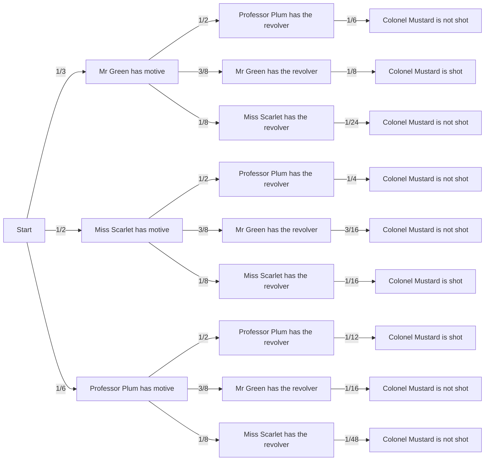

## Question 1

### Prove that the probability that exactly one of the events A or B occurs is equal to Pr[A] + Pr[B] − 2 Pr[A ∩ B].

$Pr(A) = Pr(A - B) + Pr(A \cap B)$

$Pr(A - B) =  Pr(A) - Pr(A \cap B)$

$Pr(B) = Pr(B - A) + Pr(A \cap B)$

$Pr(B - A) =  Pr(B) - Pr(A \cap B)$

The probability that exactly one of the events A or B occurs is $Pr((A - B) \cup (B - A))$.

Since (B - A) and (A - B) are disjoint, $Pr((A - B) \cup (B - A)) = Pr(A - B) + Pr(B - A)$

$Pr((A - B) \cup (B - A)) =  Pr(A) - Pr(A \cap B) + Pr(B) - Pr(A \cap B)$ 

= $Pr(A) + Pr(B) - 2Pr(A \cap B)$

## Question 2

A pair of n-sided fair dice are rolled (there is equal probability of rolling each number
from {1, 2, . . . , n})

### What is the probability that the second dice lands on a higher value than does the first?
The probability of obtaining the pair (a, b), where $a, b \in [1, n]$, is $\frac{1}{n^2}$.
Let $S = {(a, b) | a, b \in [1, n]}$

Let $X_i$ be the probability of rolling a higher value given that we obtained i on the first 
roll, where $i \in [1, n]$. Since we have a uniform probability space, we know that $Pr(X_i)$ =
$\frac{|\{a | a > i \wedge a \in S\}|}{|S|}$ = $|{a | a > i \wedge a \in S}| * \frac{1}{n^2}$.

$Pr(X_1) = \frac{n - 1}{n^2}$

$P(X_2) = \frac{n - 2}{n^2}$

$P(X_3) = \frac{n - 3}{n^2}$

$P(X_x) = \frac{n - x}{n^2}$

To calculate the probability that the second die has a higher value than the first,
we must consider all the possible values for the first die. Our range of values 
for the first die is limited to [1, n]. 

When summing all the probabilities, $Pr(X_1 + X_2 + ... X_n)$, we notice that the events 
are disjoint and the expression $Pr(X_1 + X_2 + ... X_{n})$ simplifies to 
$Pr(X_1) + Pr(X_2) + ... Pr(X_{n - 1}) + Pr(X_n)$.

Note: $Pr(X_n)$ is zero since there is no larger value that the second die can take on.

We can factor out the $\frac{1}{n^2}$ term from the summation, and we are left with 
$\frac{1}{n^2}(n -1 + n -2 + .... 1)$.

Using the fact that the summation of the numbers from 1 to n is $\frac{n(n + 1)}{2}$, 
the summation from 1 to n - 1 is $\frac{(n - 1)(n)}{2}$.

$\frac{1}{n^2}(n -1 + n -2 + .... 1)$

= $\frac{(n - 1)(n)}{2n^2}$

= $\frac{(n - 1)}{2n}$

### Given that the first dice is between 1 and m (for m ≤ n), what is the probability that the second dice lands on a higher value than does the first? 

In this case, I must calculate $Pr(X_1) + Pr(X_2) + ... Pr(X_{m})$.

For all the possible rolls, I know that I am limited to $m$ values for the first roll 
and $n$ values for the second roll. The total number of values in my new sample space 
is $mn$.

Knowing that $Pr(X_m) = \frac{n - m}{n^2}$, the expression $Pr(X_1) + Pr(X_2) + ... Pr(X_{m})$ 
is equivalent to $\frac{1}{mn}(n -1 + n - 2 + .... n - m)$

Summing the values from [n - m, n - 1], it is $\frac{(2n - m -1)(m)}{2}$. (Using the summation formula)

$Pr(X_1) + Pr(X_2) + ... Pr(X_{m})$ 

= $\frac{(2n - m -1)(m)}{2mn}$

The probability that the second dice lands on a higher value than the first is

$\frac{(2n - m -1)}{2n}$.

## Question three
Suppose that an insurance company classifies people into one of three classes – good risks, average risks, and bad risks. Their records indicate that the probabilities that good, average, and bad risk persons will be involved in an accident over a 1-year span are, respectively, 0.05, 0.15, and 0.30. If 20% percent of the population are good risk, 50% percent are average risk and 30% percent are bad risk,

### What is the probability that a person has an accident in a fixed year? 
Let G, A, and B be the events where a person has good, average, and bad risk respectively.

$Pr(G) = 0.2$

$Pr(A) = 0.5$

$Pr(B) = 0.3$

Let AC be the event where someone is involved in an accident. 

$Pr(AC | G) = 0.05$

$Pr(AC | A) = 0.15$

$Pr(AC | B) = 0.30$

Using the law of total probability, $Pr(AC) = Pr(AC | G)Pr(G) + Pr(AC | A)Pr(A) + Pr(AC | B)Pr(B)$

$Pr(AC) = 0.05 * 0.2 + 0.5 * 0.15 + 0.3 * 0.3$

$Pr(AC) = 0.175$

### If a policy holder had no accidents in the 1-year span, what is the probability that they are good risk?

Calculate $Pr(G | AC^{\complement})$

$Pr(G | AC^{\complement}) = \frac{Pr(G \cap AC^{\complement})}{Pr(AC^{\complement})}$

$Pr(AC^{\complement}) = 1 - Pr(AC)  = 0.825 $

$Pr(G | AC^{\complement}) = \frac{Pr(G \cap AC^{\complement})}{Pr(AC^{\complement})}$

$Pr(AC | G) = \frac{Pr(AC \cap G)}{Pr(G)}$

$Pr(AC^{\complement} | G) = \frac{Pr(AC^{\complement} \cap G)}{Pr(G)}$

$Pr(G \cap AC^{\complement}) = Pr(AC^{\complement} | G)Pr(G)$

$Pr(G \cap AC^{\complement}) = (1 - Pr(AC | G))* 0.2 = 0.19$

$Pr(G \cap AC^{\complement}) = 0.95 * 0.2 = 0.19$

$Pr(G | AC^{\complement}) = \frac{Pr(G \cap AC^{\complement})}{Pr(AC^{\complement})}$

$Pr(G | AC^{\complement}) = \frac{0.19}{0.825} = 0.23$

The probability that a policy holder has a good risk is 23%.

## Question four

Two integers are selected at random from {1, 2, . . . , n}

Let $C$ be the set of integers from 1 to n.

###  What is the probability that the integers are consecutive?
If the integers are selected at random, that means this is a uniform probability space. 

Let $S$ be the set of all possible pairs of integers from $C$. 

$|S| = \binom{n}{2}$

Using the fact it is a uniform probability space, the probability of picking a pair of integers 
is $\frac{1}{|S|} = \frac{1}{\binom{n}{2}}$.

For the numbers (1, 2, 3, 4, 5), there are four pairs of consecutive numbers, being (1, 2), (2, 3),
(3, 4), and (4, 5).

For the numbers (1, 2, 3), there are two pairs of consecutive numbers, being (1, 2) and (2, 3).

For n consecutive numbers, we have n - 1  pairs of consecutive numbers. 

Let $T$ be the event that the pair of integers selected from $C$ are consecutive numbers.

Using the characteristic of a uniform probability space that $Pr(E) = \frac{|E|}{|S|}$,
$Pr(T) = \frac{|T|}{|S|}$

$Pr(T) = \frac{n - 1}{\binom{n}{2}}$

### What is the probability that their sum is odd?

To be sure that two numbers will have an odd sum, the numbers being summed must be even and 
odd. By summing a number of the form $2k + 1$ and another number of the form 
$2t$, $t, k \in \mathbb{Z}$, we will obtain $2(k + t) + 1$, another odd number.

Let $C^{\text{even}}$ be the set of all the even integers in $C$.

Let $C^{\text{odd}}$ be the set of all the odd integers in $C$.

Since we need to generate all the pairs $(a, b), a \in C^{\text{even}}, b \in C^{\text{odd}}$, 
this is equivalent to doing $C^{\text{even}} X C^{\text{odd}}$.

Let $SO = C^{\text{even}} X C^{\text{odd}}$.

Since we have a uniform probability space, $Pr(SO) = \frac{|SO|}{|S|}$

$|SO| = |C^{\text{even}}| X |C^{\text{odd}}|$

$|SO| = \frac{n}{2} * \frac{n}{2} = \frac{n^2}{4}$

$Pr(SO) = \frac{|SO|}{|S|}$

$Pr(SO) = \frac{n^2}{4\binom{n}{2}}$

$Pr(SO) = \frac{n}{2n - 2}$

### Question five
Three cards are drawn one after the other from an ordinary 52-card deck without replacement (once a card is drawn, it is not placed back in the deck). 

### Compute the probability that all of the three cards is a heart

Let $H$ be the event that all the three cards are a heart.

Since we have an ordinary card deck, this implies that the probability of picking any three 
cards is the same regardless of what is picked. 

Since we have a uniform probability space, $Pr(E) = \frac{|E|}{|S|}$, where $S$ is the sample 
space.

Let $S$ be all the possible combination of three cards from the deck. There are 
$\binom{52}{3}$ many ways to pick three cards from the deck, meaning $|S| = \binom{52}{3}$.

$|H| = \binom{13}{3}$ since it represents all the ways to have all the three drawn cards to 
be hearts.

Using the fact we have a uniform probability space, $Pr(H) = \frac{|H|}{|S|}$ 

$Pr(H) = \frac{\binom{13}{3}}{\binom{52}{3}}$

### Compute the probability that none of the three cards is a heart

Let $NH$ be the event that none of the three drawn cards is a heart.

$Pr(NH) = \frac{|NH|}{|S|}$

The number of ways to draw three cards which are not hearts is $\binom{39}{3} = |NH|$

$Pr(NH) = \frac{\binom{39}{3}}{\binom{52}{3}}$

### Compute the probability that exactly one of the three cards is a heart

Let $OH$ be the event that one of the three cards is a heart.

$Pr(OH) = \frac{|OH|}{|S|}$

The number of ways to draw three cards where only one of them is a heart is
$13\binom{39}{2} = |OH|$

$Pr(OH) = \frac{13\binom{39}{2}}{\binom{52}{3}}$

## Question six

### Suppose we have n students and k tasks need to be assigned to these students. Since the professor is lazy, he assigns each task to a randomly selected student. A student gets angry if they are assigned more than one task. Calculate the probability that no student gets angry.

The tasks are not unique.

Since $k$ can take on any positive integer value, we have the case where $k > n$ and where
$k \le n$.

Since the probability that a professor selects a student is random, the probability that 
they select k students is also random, implying we have a uniform probability space.

For the students not to be angry, each student must have no task or one task.

Let $NA$ be the event that no student gets angry.

Let $T$ be the event that there are more tasks than students.

$Pr(NA) = Pr(NA| T) + Pr(NA|T^{\complement})$

By letting the tasks be the pigeons and the students be the pigeonholes, 
by pigeonhole principle there is at least one student which has two tasks 
when the number of tasks is greater than the number of students.

Therefore, $Pr(NA|T) = 0$ regardless of any value of $k > n$.

In the case where $k \le n$, the professor must pick k students, assign a task to each 
one, and find the number of permutations of the tasks among the students.

The ways the professor can do this is $\frac{n!}{(n- k)!}$.

Let $S$ be all the ways that the professor can distribute k tasks among n students.

Since every task can be given to any student, that means we have $k^n$ possible task 
distributions.

$|S| = k^n$ .

Since we have a probability space, $Pr(NA) = \frac{|NA|}{|S|}$.

$Pr(NA) = \frac{\frac{n!}{(n- k)!}}{k^n}$.

$Pr(NA) = \frac{\frac{n!}{(n- k)!}}{k^n}$.

## Question seven
The Canadian football team has probability 0.1 of winning against Tier 1 teams, probability 0.25 of winning against Tier 2 teams and probability 0.5 of winning against Tier 3 teams. Half the teams in the league are Tier 1 while a quarter of them are Tier 2 and a quarter of them are Tier 3. The odds of an event A is given by:

Let $W$ be the event the Canadian team wins.

Let $T_1$ be the event the Canadian team encounters a Tier 1 team. 

Let $T_2$ be the event the Canadian team encounters a Tier 2 team.

Let $T_3$ be the event the Canadian team encounters a Tier 3 team.

$Pr(T_1) = 0.5$

$Pr(T_2) = 0.25$

$Pr(T_3) = 0.25$

$Pr(W | T_1) = 0.1$

$Pr(W | T_2) = 0.25$

$Pr(W | T_3) = 0.5$

### What are the odds that the Canadian football team wins against a randomly chosen team?

$Pr(W) = Pr(W|T_1)Pr(T_1) + Pr(W| T_2)Pr(T_2) + Pr(W| T_3)Pr(T_3)$

$Pr(W) = 0.5 * 0.1 + 0.25 * 0.25 + 0.25 * 0.5$

$Pr(W) = 0.5 * 0.1 + 0.25 * 0.25 + 0.25 * 0.5$

$Pr(W) = 0.2375$

$Odds(W) = \frac{Pr(W)}{1 - Pr(W)}$

$Odds(W) = \frac{0.2375}{0.7625}$

$Odds(W) = 0.31$

### Given that Canada wins the game, what is the probability that the opponent was a Tier 2 team?

$Pr(T_2 | W) = ?$

$Pr(T_2 | W) = \frac{Pr(T_2 \cap W)}{Pr(W)}$

$Pr(W | T_2) = \frac{Pr(T_2 \cap W)}{Pr(T_2)}$

$Pr(T_2 \cap W) = Pr(W | T_2)Pr(T_2)$

$Pr(T_2 | W) = \frac{Pr(W | T_2)Pr(T_2)}{Pr(W)}$

$Pr(T_2 | W) = \frac{Pr(W | T_2)Pr(T_2)}{Pr(W)}$

$Pr(T_2 | W) = \frac{0.0625}{0.2375}$

$Pr(T_2 | W) = 0.26$

## Question eight

A class consisting of 4 men and 12 women is randomly divided into four groups (labelled Group A, Group B, Group C and Group D) each of size 4.

We have a uniform probability space we randomly pick the people to form the groups.

### What is the number of possible groups that can be formed?

To form the four groups, I must pick four people to be in group A, then pick 
four people from the remaining 12 to be in group B, and then pick four people from the 
remaining 8 to be in group C, and put the remaining people in group D.

This can be modeled as $\binom{16}{4}\binom{12}{4}\binom{8}{4}\binom{4}{4}$

Expanding the last expression out, we have
$\frac{16!}{12!4!}\frac{12!}{8!4!}\frac{8!}{4!4!}\frac{4!}{4!}$ =

$\frac{16!}{(4!)^4}$

We have $\frac{16!}{(4!)^4}$ many possible formations for groups A, B, C, and D.

### Suppose we impose the restriction that each group needs to have exactly 1 man, what is the number of possible groups that can be formed?

If each group has one man, then I only need to pick three people to be in group A, then
another three people to be in group B from the remaining 9, three people to be in group 
C from the remaining six, and put the people that are left into group D.

For the ordering of the men, there are 4! ways of having the men be in different groups.

This can be modeled as $4!\binom{12}{3}\binom{9}{3}\binom{6}{3}\binom{3}{3}$

Expanding the last expression out, we have
$4!\frac{12!}{9!3!}\frac{9!}{3!6!}\frac{6!}{3!3!}\frac{3!}{3!}$ =

$4!\frac{12!}{(3!)^4}$.

### Use the above results to calculate the probability that each group includes exactly man

Since we have a uniform probability space, $Pr(E) = \frac{|E|}{|S|}$, where $S$ is our sample 
space.

Let $M$ be the event we have one man in every group.

Let $S$ be all the ways of making four groups.

$Pr(M) = \frac{|M|}{|S|}$

$Pr(M) = \frac{4!\frac{12!}{(3!)^4}}{\frac{16!}{(4!)^4}}$

$Pr(M) = 4!\frac{12!}{(3!)^4}\frac{(4!)^4}{16!}$

$Pr(M) = \frac{(4!)^5 12!}{16!(3!)^4}$

$Pr(M) = \frac{4^4 * 4! * 12!}{16!}$

$Pr(M) = \frac{4^4 * 4!}{16 * 15 * 14 * 13}$

$Pr(M) = \frac{4^2 * 4!}{15 * 14 * 13}$

$Pr(M) = \frac{4^3 * 3}{15 * 7 * 13}$

$Pr(M) = 0.141$

## Question nine

A ball is in one of n boxes. It is in box i with probability pi. If the ball is in box i, a
search of that box will discover it with probability αi.

### Prove that the conditional probability that the ball is in box j, given that a search of box i did not discover it, is

Let $B_i$ be the event that a ball is in box i. $Pr(B_i) = p_i$

Let $S_i$ be the event that the box was discovered in box i. $Pr(S_i | B_i) = a_i$

$Pr(S_i|{B_i}^{\complement}) = 0$

### Case: i = j

Calculate: $Pr(B_j | {S_i}^{\complement})$

$Pr(B_j | {S_i}^{\complement})$

= $\frac{Pr(B_j \cap {S_i}^{\complement})}{Pr({S_i}^{\complement})}$

= $\frac{Pr(B_i \cap {S_i}^{\complement})}{Pr({S_i}^{\complement})}$

$Pr(S_i) = Pr(S_i|B_i)Pr(B_i) + Pr(S_i|{B_i}^{\complement})Pr({B_i}^{\complement})$ (by The Law of Total Probability)

$Pr(S_i) = Pr(S_i|B_i)Pr(B_i)$ 

$Pr(S_i) = a_ip_i$ 

$Pr({S_i}^{\complement}) = 1 - a_ip_i$ 

$Pr({S_i}^{\complement} | B_i) = \frac{Pr({S_i}^{\complement}  \cap B_i)}{Pr(B_i)}$

$Pr({S_i}^{\complement}  \cap B_i) = Pr({S_i}^{\complement} | B_i)Pr(B_i)$

$Pr({S_i}^{\complement}  \cap B_i) = (1 - a_i)p_i$

$Pr(B_j | {S_i}^{\complement}) = \frac{Pr(B_i \cap {S_i}^{\complement})}{Pr({S_i}^{\complement})}$

$Pr(B_j | {S_i}^{\complement}) = \frac{(1 - a_i)p_i}{1 - a_ip_i}$

### Case: i != j

Calculate: $Pr(B_j | {S_i}^{\complement})$

$Pr(B_j | {S_i}^{\complement})$

= $\frac{Pr(B_j \cap {S_i}^{\complement})}{Pr({S_i}^{\complement})}$

$Pr({S_i}^{\complement} | B_j) = \frac{Pr({S_i}^{\complement} \cap B_j)}{Pr(B_j)}$

$Pr({S_i}^{\complement} \cap B_j) =  Pr({S_i}^{\complement} | B_j)Pr(B_j)$

$Pr({S_i}^{\complement} | B_j) = 1$ since the box will never be found in box i
if it is in box j.

$Pr({S_i}^{\complement} \cap B_j) =  Pr({S_i}^{\complement} | B_j)Pr(B_j)$

$Pr({S_i}^{\complement} \cap B_j) =  Pr(B_j)$

$Pr({S_i}^{\complement} \cap B_j) =  p_j$

Using $Pr({S_i}^{\complement}) = 1 - a_ip_i$ from the case $i = t$,

$Pr(B_j | {S_i}^{\complement})$

= $\frac{Pr(B_j \cap {S_i}^{\complement})}{Pr({S_i}^{\complement})}$

= $\frac{p_j}{1 - a_ip_i}$

## Question 10

### Make a tree diagram

### What is the probability that Colonel Mustard is shot? 
The probability that Colonel Mustard is shot is the sum of all the outcomes where he 
is shot by either Professor Plum, Mr Green, or Miss Scarlet.

Let $M$ be the event where Colonel Mustard is shot. 

Let $S$ be the event that Miss Scarlet has motive.

Let $P$ be the event that Professor Plum has motive.

Let $G$ be the event that Mr Green has motive.

$Pr(M) = Pr(M|G)Pr(G) + Pr(M|S)Pr(S) + Pr(M|P)Pr(P)$ (using the Law of Total Probability)

We can obtain these probabilities from the edge diagrams above, resulting in
$Pr(M)$ being $\frac{1}{8} + \frac{1}{16} + \frac{1}{12}$, corresponding to the probabilities
Pr(M|G)Pr(G), Pr(M|S)Pr(S), Pr(M|P)Pr(P) respectively.

$Pr(M)  = \frac{13}{48}$

###  What is the probability that Colonel Mustard is shot, given that Miss Scarlet does not have the revolver?

Let $S$ be the event that Miss Scarlet has the revolver.

Let $P$ be the event that Professor Plum has the revolver.

Let $G$ be the event that Mr Green has the revolver.

We are asked to find $Pr(M | S^{\complement})$.

$Pr(M | S^{\complement}) = \frac{Pr(M \cap S^{\complement})}{Pr(S^{\complement})}$

Since we know that $Pr(S) = \frac{1}{8}$ from the tree diagram,
$Pr(S^{\complement}) = 1 - Pr(S)$

$Pr(S^{\complement}) = \frac{7}{8}$

For $Pr(M \cap S^{\complement})$, we can sum up all the outcomes where 
Colonel Mustard was shot by Professor Plum or by Mr Green.

$Pr(M \cap S^{\complement}) = \frac{1}{12} + \frac{1}{8}$

$Pr(M \cap S^{\complement}) = \frac{5}{24}$

$Pr(M | S^{\complement}) = \frac{Pr(M \cap S^{\complement})}{Pr(S^{\complement})}$

$Pr(M | S^{\complement}) = \frac{5}{24}\frac{8}{7}$

$Pr(M | S^{\complement}) = \frac{5}{21}$

### What is the probability that Mr. Green had an opportunity, given that Colonel Mustard was shot?

Let $M$ be the event where Colonel Mustard is shot.

Let $S$ be the event that Miss Scarlet has motive.

Let $P$ be the event that Professor Plum has motive.

Let $G$ be the event that Mr Green has motive.

$Pr(G |M) = \frac{Pr(G \cap M)}{Pr(M)}$

From the tree diagram given in the first part of the question, we have that 
$Pr(M)$ and $Pr(G \cap M)$ is $\frac{13}{48} \text{and} \frac{1}{8}$, respectively.

$Pr(G |M) = \frac{Pr(G \cap M)}{Pr(M)}$

$Pr(G |M) = \frac{1}{8}\frac{48}{13}$

$Pr(G |M) = \frac{6}{13}$

## Question 11

### For an event A and two mutually exclusive events E1 and E2, prove the following statement.

Calculate $Pr[E_1 ∪ E_2|A]$:

$Pr[E_1 ∪ E_2|A]$

= $\frac{Pr((E_1 +  E_2  (- E_1 \cap E_2 )) \cap  A)}{Pr(A)}$

Since $E_1$ and $E_2$ are mutually exclusive, $E_1 \cap E_2  = \emptyset$

= $\frac{Pr((E_1 +  E_2 (- E_1 \cap E_2 )) \cap  A)}{Pr(A)}$

= $\frac{Pr((E_1 +  E_2) \cap  A)}{Pr(A)}$

= $\frac{Pr((E_1 \cap A) +  (E_2 \cap A)))}{Pr(A)}$

= $\frac{Pr(E_1 \cap A) +  Pr(E_2 \cap A)}{Pr(A)}$

= $Pr[E_1|A] + Pr[E_2|A]$

### For an event A and two mutually exclusive events E1 and E2, prove the following statement

$Pr[A|E_1 ∪ E_2] = \frac{Pr(A \cap (E_1 \cup E_2))}{Pr(E_1 \cup E_2)}$

$Pr[A|E_1 ∪ E_2] = \frac{Pr(A \cap E_1 ) + Pr(A \cap E_2)}{Pr(E_1) + Pr(E_2)}$ (Since $E_1 \cup E_2 = E_1 \cup E_2$ due to being disjoint)

$Pr(A| E_1) = \frac{Pr(A \cap E_1)}{Pr(E_1)}$

$Pr(A \cap E_1) = Pr(A| E_1)Pr(E_1)$

$Pr(A| E_2) = \frac{Pr(A \cap E_2)}{Pr(E_2)}$

$Pr(A \cap E_2) = Pr(A| E_2)Pr(E_2)$

$Pr[A|E_1 ∪ E_2] = \frac{Pr(A \cap E_1 ) + Pr(A \cap E_2)}{Pr(E_1) + Pr(E_2)}$ (Since $E_1 \cup E_2 = E_1 \cup E_2$ due to being disjoint)

= $\frac{Pr(A| E_1)Pr(E_1) + Pr(A| E_2)Pr(E_2)}{Pr(E_1) + Pr(E_2)}$

### Prove that the above rule generalizes the law of total probability

Let the following be two properties concerning $E_1 \text{and} E_2$.
* $E_1 \cup E_2 = S$
* $E_1 \cap E_2 = \emptyset$

These two properties imply that $E_2 = {E_1}^{\complement}$. If this were not true,
then we would violate property two by the fact of having a shared element, when we 
are given that there are none.

Using this knowledge, I can rewrite the expression $\frac{Pr(A| E_1)Pr(E_1) + Pr(A| E_2)Pr(E_2)}{Pr(E_1) + Pr(E_2)}$

as = $\frac{Pr(A| E_1)Pr(E_1) + Pr(A|{E_1}^{\complement})Pr({E_1}^{\complement})}{Pr(E_1 cup E_2)}$

as = $\frac{Pr(A| E_1)Pr(E_1) + Pr(A|{E_1}^{\complement})Pr({E_1}^{\complement})}{Pr(S)}$

Using the fact that $P(S) = 1$, the expression above becomes

$Pr(A| E_1)Pr(E_1) + Pr(A|{E_1}^{\complement})Pr({E_1}^{\complement})$.

This is the equation for  the law of total probability when partitioning on $E_1$ and
${E_1}^{\complement}$

