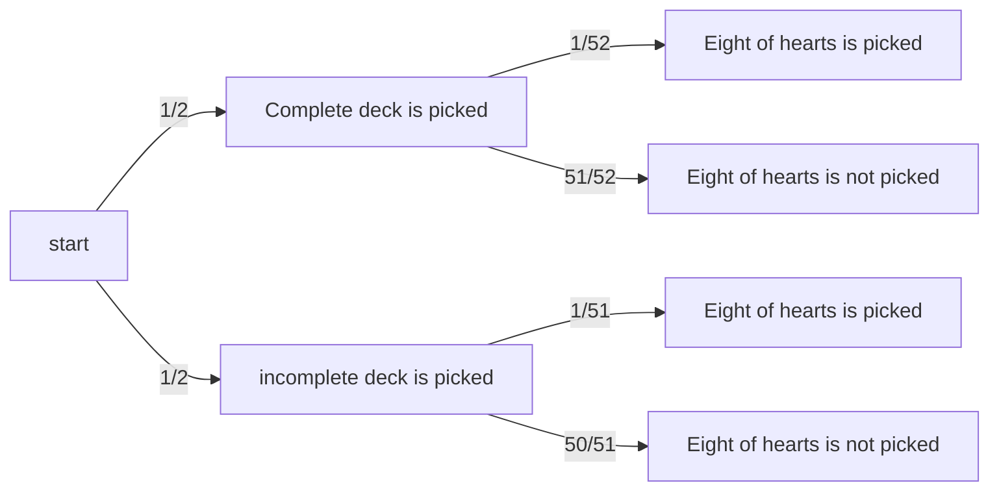

## 17.2

Dirty Harry places two bullets in random chambers of the six-bullet cylinder of his
revolver. He gives the cylinder a random spin and says “Feeling lucky?” as he
holds the gun against your heart.

### What is the probability that you will get shot if he pulls the trigger?

If Harry places the bullets randomly, then it means that the bullets are equally likely 
to be in any chamber. Consequently, we have a uniform probability space. 

Let $SH$ denote the event where you are shot. $SH$ only occurs if we get shot with one of two bullets 
in the revolver.

Let $C_1$ and $C_2$ be the events where you get shot with the first or second bullet respectively.

Using the events above, we can say that $Pr(SH) = Pr(C_1 \cup C_2)$.

SHince $C_1$ and $C_2$ are disjoint, $Pr(C_1 \cup C_2) = Pr(C_1) + Pr(C_2)$.

Since we have a uniform probability space, $Pr(C_1) = Pr(C_2) = \frac{1}{|S|}$, where 
$S$ represents the possible locations of a revolver. Using the fact that $|S| = 6$,
$Pr(C_1) = \frac{1}{6}$.

Using the values above for $Pr(C_1)$ and $Pr(C_2)$, $Pr(SH) = \frac{2}{6} = \frac{1}{3}$.

### Suppose he pulls the trigger and you don’t get shot. What is the probability that you will get shot if he pulls the trigger a second time?

Let $NS$ be the event that we are not shot on the first attempt, and $SS$  be the event 
we are shot on the second attempt.

We must now calculate $Pr(SS| NS)$.

Let $S$ be our sample space which denotes all possible pairs of the form $(c_x, c_y)$, where 
$c_y$ and $c_x$ represents the chambers which are fired on the first and second attempt respectively.
$|S| = 30$. 

Expanding out the expression $Pr(SS| NS)$, we obtain $\frac{Pr(SS \cap NS)}{Pr(NS)}$.

Calculating $Pr(SS \cap NS)$, we find that there are only eight events where this intersection occurs.
Using the fact we have a uniform probability space, we know that $Pr(SS \cap NS)$ evaluates
to $\frac{8}{30} = \frac{4}{15}$.

We must find the value of $Pr(NS)$ in order to obtain $Pr(SS| NS)$. We know that $Pr(NS)$ 
sums the probabilities of firing from the four empty chambers. Since we can only fire from one 
of the four empty chambers, we know we are summing the probabilities of disjoint events. 

Since we have a uniform probability space, $Pr(NS) = \frac{20}{30} = \frac{2}{3}$.

Now that we have $Pr(NS)$ and $Pr(SS \cap NS)$, we can now calculate
$Pr(SS| NS)$.

$Pr(SS | NS) = \frac{4}{15}\frac{3}{2} = \frac{2}{5}$ 

## Suppose you noticed that he placed the two shells next to each other in the cylinder. How does this change the answers to the previous two questions?

For the first part of the problem, this does not change the probability since we are still 
summing the probability of firing from the first or second cylinder which has a bullet.

For the second part, the probability of being shot on the second attempt lowers since 
there is only one event where the first shot will be unsuccessful and the second shot 
will be successful. This changes our probability of $\frac{2}{5}$ to $\frac{1}{4}$.
Since the two bullets are next to each other, we know that if we did not fire a bullet on 
the first attempt and fired one on the second attempt, it means the first chamber was one 
directly before the filled chambers. 
There are only six possible events when considering the firing of the bullets, and only 
one which results in the person being shot on the second attempt. 
Therefore, the probability becomes $\frac{1}{6}\frac{3}{2} = \frac{1}{4}$.

## Question 17.5 
There are two decks of cards. One is complete, but the other is missing the Ace
of spades. Suppose you pick one of the two decks with equal probability and then
select a card from that deck uniformly at random. What is the probability that you
picked the complete deck, given that you selected the eight of hearts? Use the
four-step method and a tree diagram.

Let $D_c$ and $D_{ic}$ be the probabilities of drawing either the complete deck or incomplete deck.
$Pr(D_c) = Pr(D_{ic}) = \frac{1}{2}$.

Let $CP$ be the event of selecting a specific card in the deck.
$Pr(CP) = Pr(CP | D_c)Pr(D_C) + Pr(CP|D_{ic})Pr(D_{ic})$.

$Pr(CP) = \frac{1}{52}\frac{1}{2} + \frac{1}{51}\frac{1}{2}$.

Let H be the event that the eight of hearts was selected.

Calculate the following: $Pr(D_c | H)$.

I will draw out the tree diagram below:

Using the diagram, I will obtain the value of
$Pr(D_c | H)$.

Expanding the expression out, I obtain $\frac{Pr(D_c \cap H)}{Pr(H)}$

Using the diagram, I see the values of $Pr(D_c \cap H)$ and $Pr(H)$ are $\frac{1}{104}$ 
and $\frac{1}{104} + \frac{1}{102}$.

Using these values, $Pr(D_c | H)$ evaluates to $\frac{102}{206} = \frac{51}{103}$

## Question 17

A flip of Coin 1 is x times as likely to come up Heads as a flip of Coin 2. A
biased random choice of one of these coins will be made, where the probability of
choosing Coin 1 is w times that of Coin 2.

### Restate the information above as equations between conditional probabilities involving the events C1 WWD Coin 1 was chosen; C 2 WWD Coin 2 was chosen; H WWD the chosen coin came up Heads: 

$Pr(C2) = p$

$Pr(C1) = wp$

$Pr(H | C2) = q$

$Pr(H | C1) = xq$.

### State an inequality involving conditional probabilities of the above events that formalizes the assertion “Given that the chosen coin came up Heads, the chosen coin is more likely to have been Coin 1 than Coin 2.” 
$Pr(C1 | H) > Pr(C2 | H)$
Ask professor if more likely includes $\ge$.

### Prove that, given that the chosen coin came up Heads, the chosen coin is more likely to have been Coin 1 than Coin 2 iff wx > 1

#### Prove forward direction

$Pr(H) = Pr(H| C1)Pr(C1) + Pr(H| C2)Pr(C2)$

$Pr(H) = xqwp + qp$

$Pr(H) = qp(xw + 1)$

If the probability that heads appears on Coin 1 is greater than Coin 2, then this 
means that xqwp > qp, which is equivalent is xw > 1 after factoring out qp.

#### Prove backwards direction

$Pr(H) = qp(xw + 1)$

For $Pr(H)$ to be a valid probability, $qp \le \frac{1}{xw + 1}$

Given that xw > 1, the above expression becomes
$qp < \frac{1}{1 + 1} = qp < \frac{1}{2}$

Since $qp < \frac{1}{2}$ and $xw > 1$, we know that $xwqp > qp * 1$.
Considering that qp represents the probability of obtaining a heads on coin two and 
xwqp represents the probability of obtaining a head with coin 1, we can say that the 
probability of obtaining a head with coin 1 is higher than the probability of 
obtaining a heads on coin two.